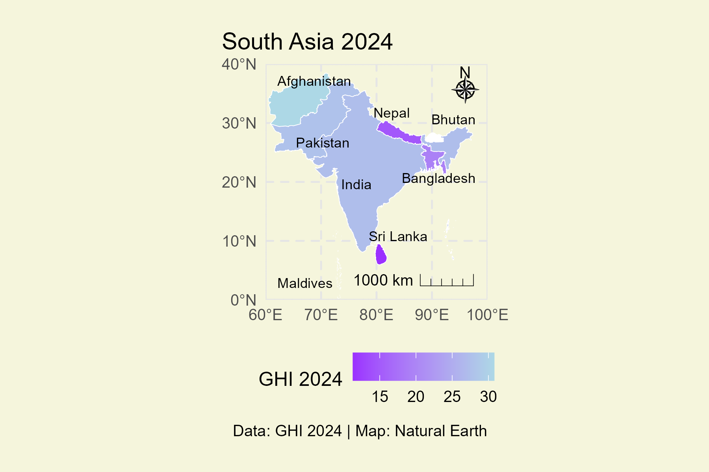
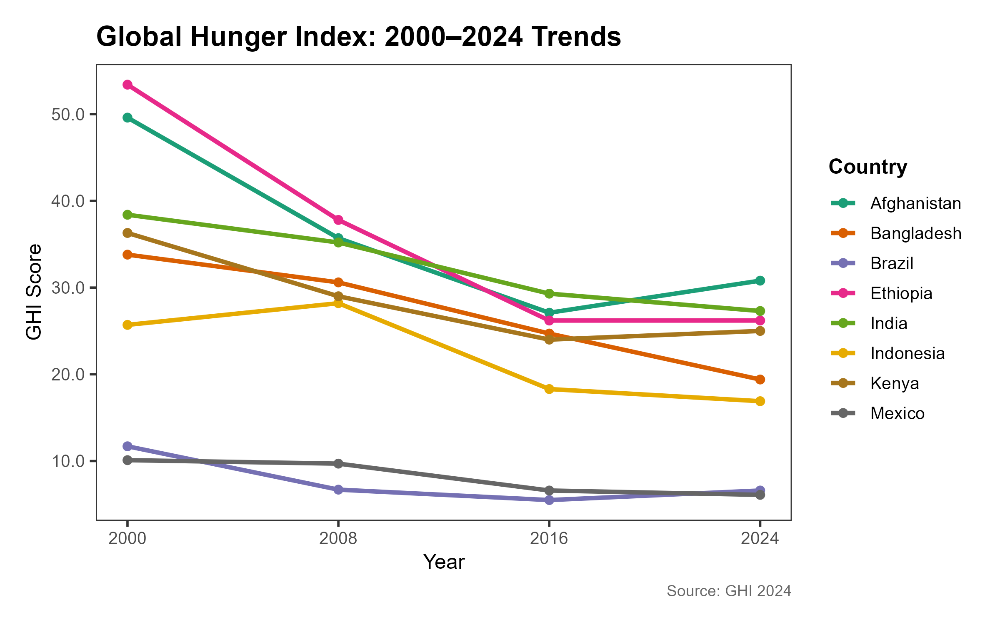

# Global-Hunger-Index-2024-Data-Visualization-Insights-with-R
This project is an exploratory data analysis and visualization exercise based on the **2024 Global Hunger Index (GHI)** dataset. It highlights trends in GHI score in South Asian countries using R programming.

---

## 📌 Purpose

The primary goal of this project is to:
- Analyze GHI scores across South Asia.
- Create clear and compelling visualizations for communicating data-driven insights.
- Showcase data visualization skills using R and real-world public health data.

---

## 📂 Dataset

- Source: Global Hunger Index 2024 (publicly available dataset)
- File: `2024.xlsx`, [Source](https://www.globalhungerindex.org/)
- Contains data on:
  - GHI Score
  - Child wasting, stunting, mortality
  - Undernourishment levels
  - Country-wise hunger levels

---

## 📊 Tools & Packages Used

- `ggplot2` – for visualizations
- `readxl` – for Excel data import
- `dplyr` – for data wrangling
- `sf` + `rnaturalearth` – for mapping
- `ggsave` – for exporting high-quality visuals

---

## 📍 Output Examples

### 🔹 South Asia Choropleth Map  

### 🔹 GHI Trendline (by Country)  

---

## ▶️ How to Reproduce

1. Clone the repository  
2. Install required R packages (`ggplot2`, `readxl`, `dplyr`, `sf`)  
3. Run `01_plot_South_Asia_map.R` and `Trendline.R`  
4. Output plots will be saved in the `outputs/` folder

---

## 📎 Folder Structure
Global-Hunger-Index-2024-Data-Visualization-Insights-with-R/
│
├── outputs/ # Output visuals
├── 2024.xlsx # GHI dataset (2024)
├── 01_plot_South_Asia_map.R # Code to generate GHI map
├── Trendline.R # Code to create trendline plot
├── south_asia_ghi_map.png # Sample output image
├── ne_10m_admin_0_countries.zip # Shapefiles used for mapping
├── Global-Hunger-Index-2024-...pdf # Brief writeup or summary
└── README.md # This file

---

## 👩‍💻 Author

**Afsana Ashrafi**  
Graduate Researcher – Nutrition and Food Science  
📧 afsanaashrafi41@gmail.com  
🔗 [LinkedIn](https://www.linkedin.com/in/afsana-ashrafi-a3475119a/) | [GitHub](https://github.com/ashrafi-bd)

---

## 📘 License

This project is for academic and educational purposes only. Data used belongs to the original publishers of the Global Hunger Index.

